# <h1 align="center"> AGRO SAFARI </h1>

## <p align="center"></p>

# Índice 

* [Sobre o projeto](https://github.com/Brunosoaresfreitas/AgroSafariAPI/blob/main/README.md#-sobre-o-projeto)
* [Funcionalidades](https://github.com/Brunosoaresfreitas/AgroSafariAPI/blob/main/README.md#-sobre-o-projeto)
* [Como executar](https://github.com/Brunosoaresfreitas/AgroSafariAPI/blob/main/README.md#-como-executar-o-projeto)
* [Tecnologias](https://github.com/Brunosoaresfreitas/AgroSafariAPI/blob/main/README.md#%EF%B8%8F-tecnologias)
* [Prints da API documentada no Swagger](https://github.com/Brunosoaresfreitas/AgroSafariAPI/blob/main/README.md#documenta%C3%A7%C3%A3o-da-api)
* [Autores](https://github.com/Brunosoaresfreitas/AgroSafariAPI/blob/main/README.md#%EF%B8%8F-autores)
* [Acessar o Projeto](https://github.com/Brunosoaresfreitas/AgroSafariAPI/blob/main/README.md#-acesso-ao-projeto)

## 💻 Sobre o projeto

Agro Safari -> Plataforma que servirá como uma ponte entre os prestador de serviços agrícolas e os clientes.
Basicamente o prestador de serviço cadastrará um serviço e o cliente pode vizualizar os serviços cadastrados e contratar determinado serviço.

## 🎯 Funcionalidades

✔️ Cadastro de usuários com perfil de cliente / prestador de serviço

✔️ Login dos usuários com autenticação 

✔️ Excluir / atualizar usuários

✔️ Cadastrar / atualizar/ excluir / consultar um serviço e o seu status

✔️ Inicializar (tornar disponível) / contratar / encerrar um serviço


## 🚀 Como executar o projeto

### 📋 Pré-requisitos

Antes de executar o projeto, é necessário ter instalado em sua máquina local as seguintes ferramentas: [Git](https://git-scm.com/). 
Além disso, também alguma IDE, com as cargas de trabalho (pacotes) para rodar o ASP.NET Core WEB Api, podendo ser o VS Code por exemplo.


## 🎲 Executando a API - Passo a passo

```
# Clone este repositório
$ git clone https://github.com/Brunosoaresfreitas/AgroSafariAPI.git

# Tenha certeza de ter pelo menos o SDK dotnet 6 instalado:
$ https://dotnet.microsoft.com/en-us/download/dotnet/6.0

# Como o banco de dados está rodando local na máquina do desenvolvedor, você terá que realizar uma pequena alteração no código do projeto para simular um banco de dados em memória, já que o banco principal estarará inacessível.
$ Localize o projeto AgroSafari.API
$ Logo em seguida, localize o arquivo c# com o nome Startup.cs
$ Agora substitua o comando: 
$    services.AddDbContext<AgroSafariDbContext>(options => options.UseSqlServer(connectionString, b => b.MigrationsAssembly("AgroSafari.API"))); 
$ Por:
$   services.AddDbContext<AgroSafariDbContext>(options => options.UseInMemoryDatabase("AgroSafariDatabase"));

# Navegue até a pasta pasta onde se encontra o projeto da API

# Instale as dependências
$ dotnet restore

# Realize o build do projeto
$ dotnet build

# Execute a aplicação 
$ dotnet run

# O servidor inciará na porta:7142 - acesse http://localhost:7142/swagger
```

## 🛠️ Tecnologias

As seguintes tecnologias e métodos foram utilizadas durante o desenvolvimento do projeto

- ``C#``

- ``ASP.NET Core Web API``

- ``Entity Framework Core``

- ``SQL Server``

- ``Arquitetura Limpa``

- ``Padrão CQRS``

- ``Padrão Repository``

- ``Autenticação e autorização com JWT``

## Documentação da API 

### Endpoints:
* Endpoints 1/2:
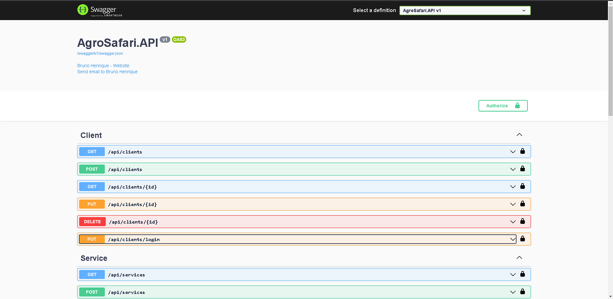
* Endpoints 2/2:


### Client / ServiceProvider (Terá somente os exemplos utilizando o client pois os endpoints dos ServiceProviders são os mesmos)
* Get Client (Obter todos os clientes cadastrados):
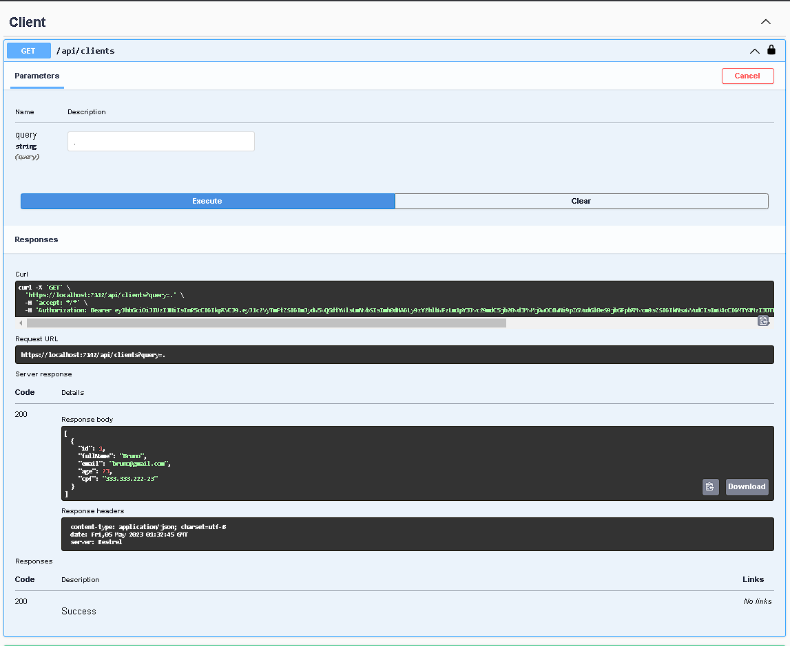
* Post Client (Cadastrar um novo cliente):
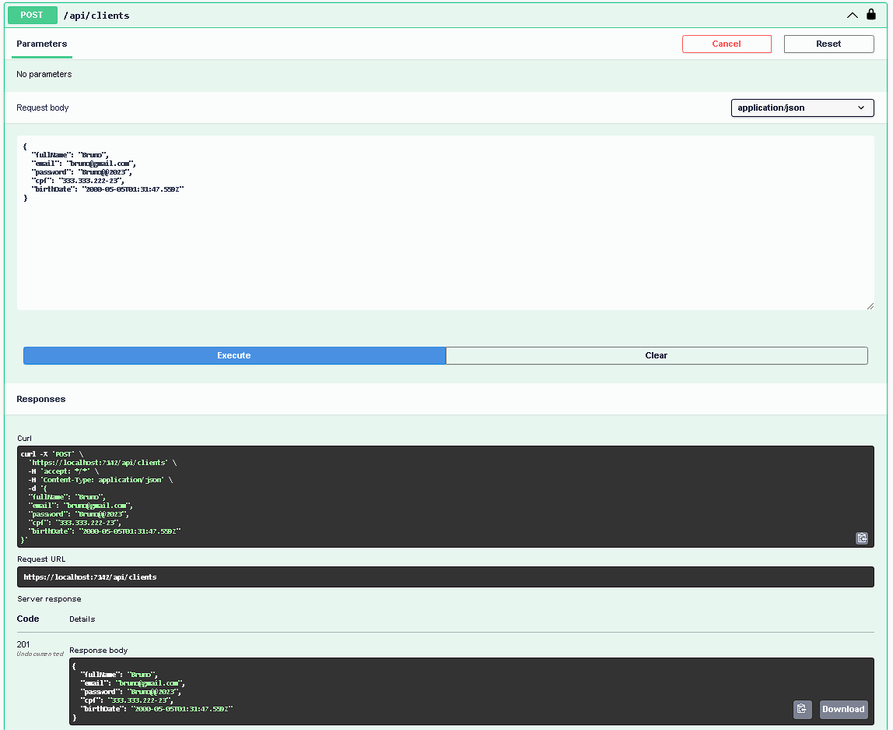
* Get Client By Id (Obter um cliente pelo seu Id):
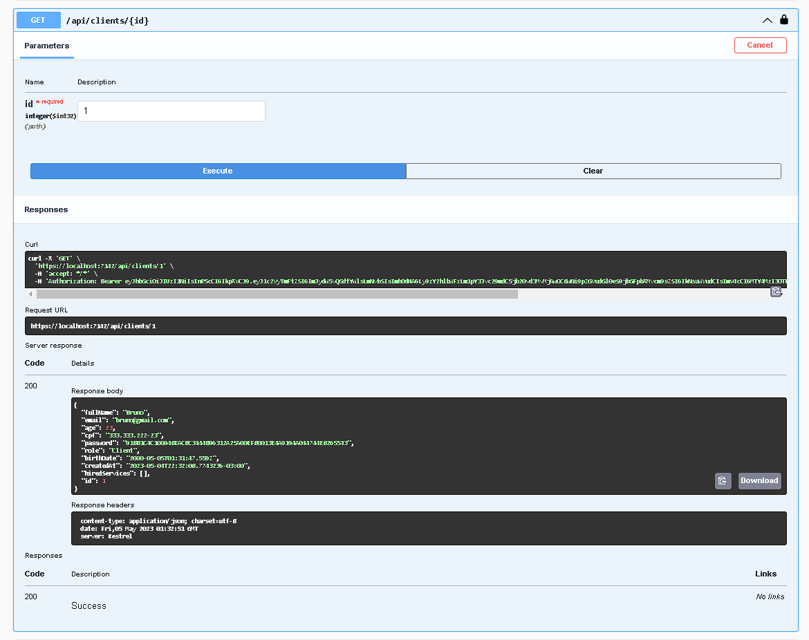
* Put Client (Atualizar o dado de um determinado cliente passando o seu Id):
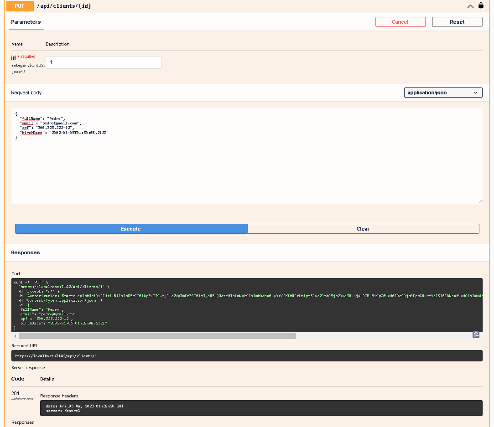
* Delete Client (Excluir um cliente):
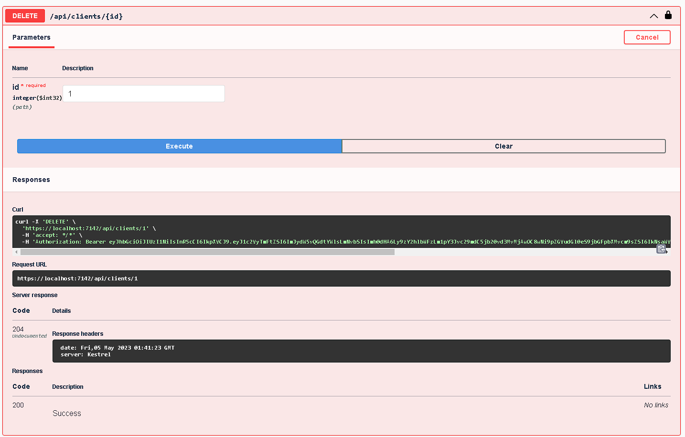
* Put Client (Realizar o login do cliente, aonde será gerado uma chave de autenticação JWT):
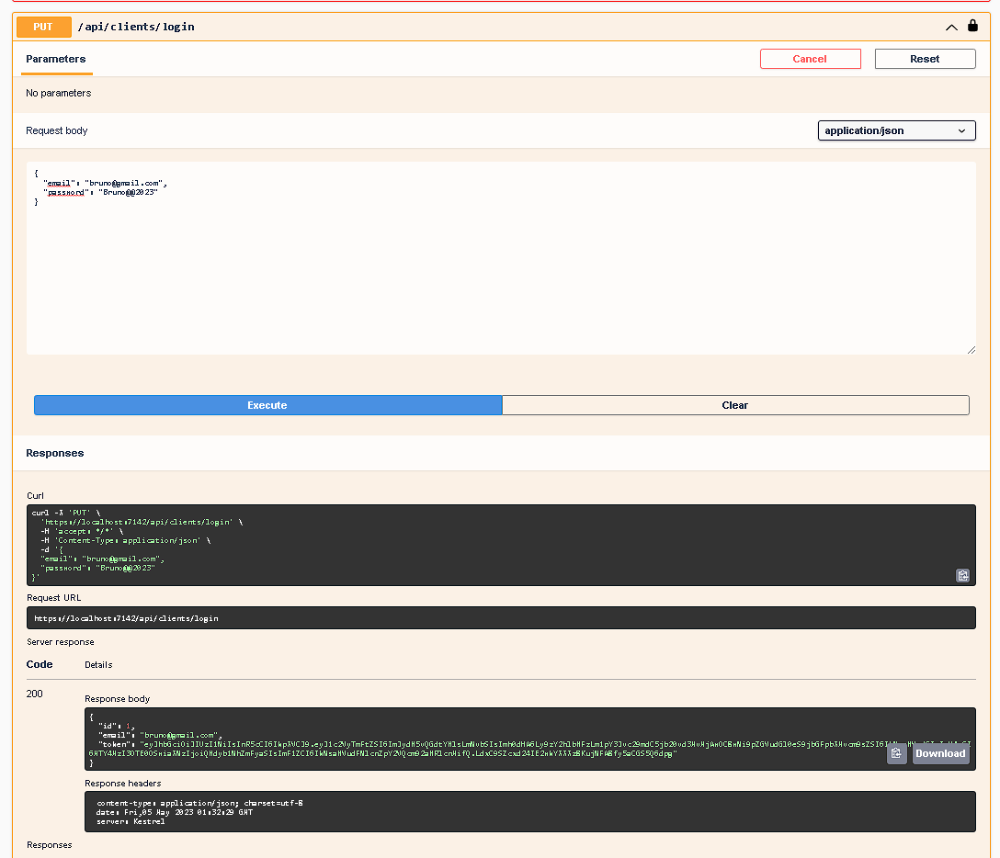

### Service (Serviço)
* Get Service (Obter todos os serviços cadastrados):
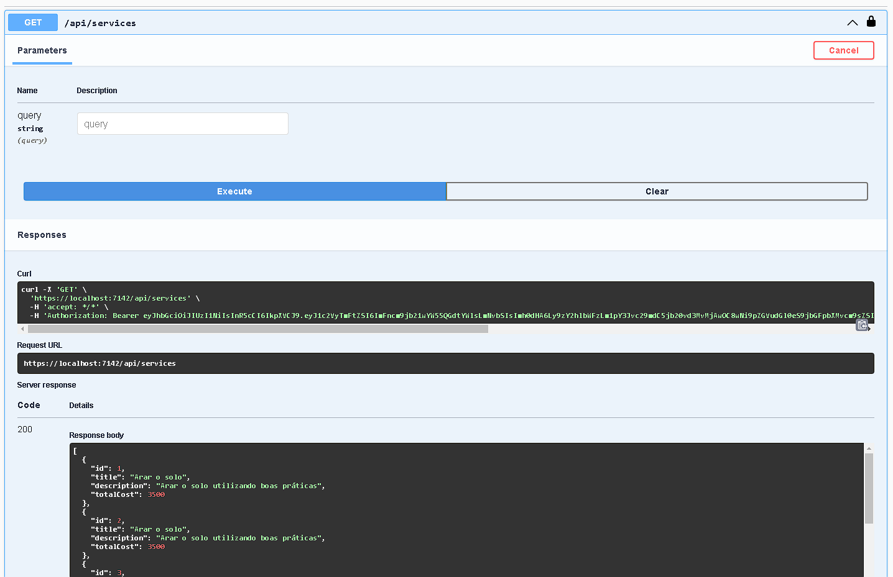
* Post Service (Cadastrar um novo serviço):
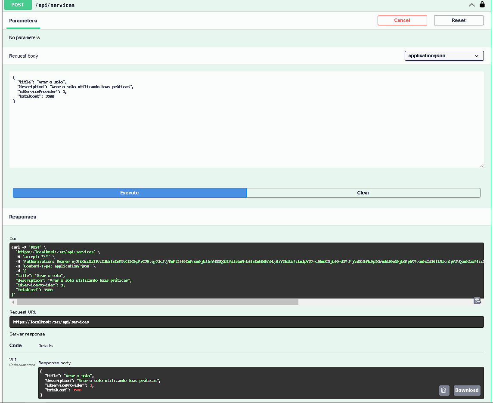
* Get Service By Id (Obter um serviço pelo seu Id):
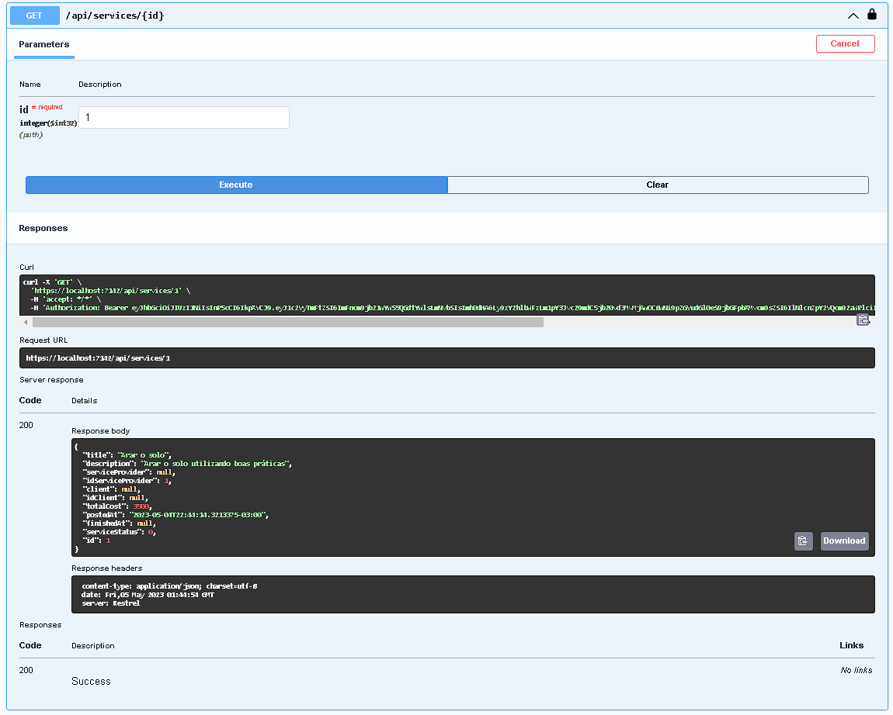
* Put Service (Atualizar o dado de um determinado serviço passando o seu Id):
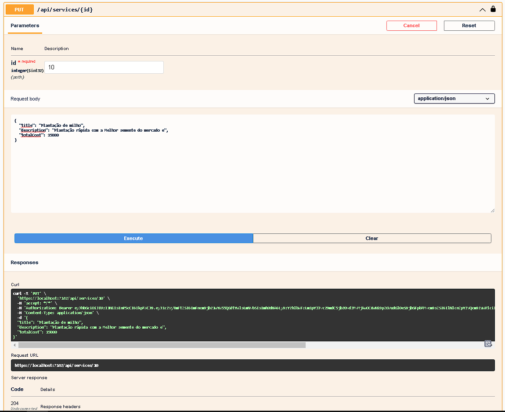
* Delete Service (Excluir um serviço):

* Put Service (Tornar o serviço disponível, função liberado somente para o prestador de serviço):
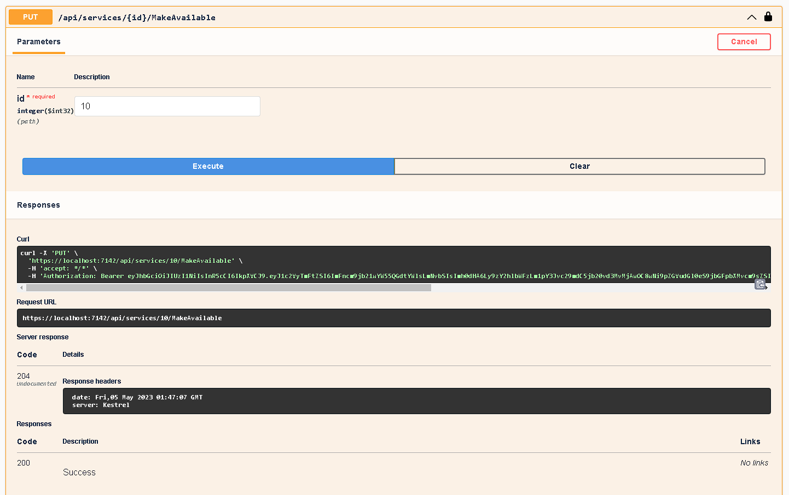
* Put Service (Contratar um serviço, função liberado somente para os clientes):
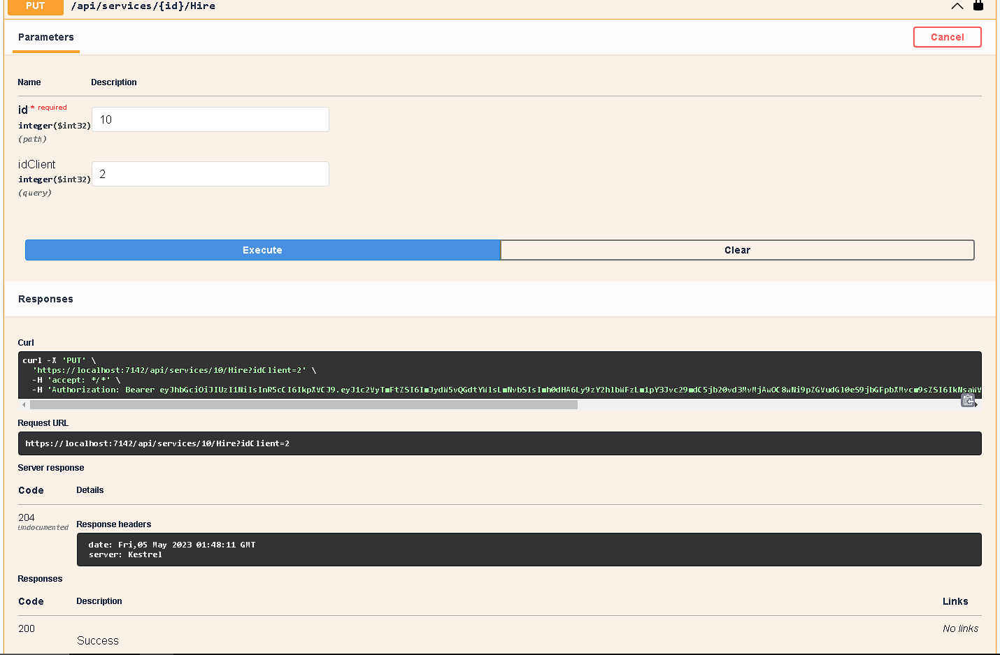
* Get Service Status (Consultar o status de um serviço específico):
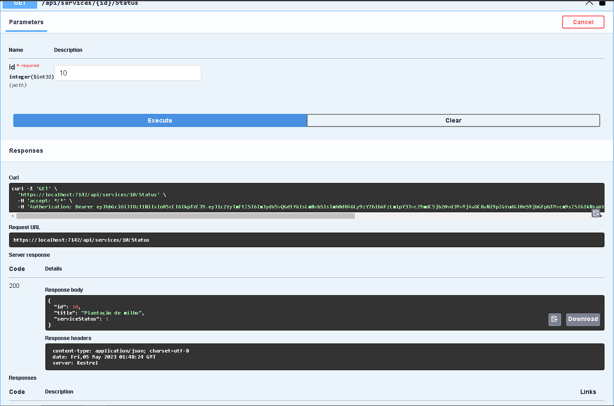

## ✒️ Autores
- Bruno Henrique Soares de Freitas
- Cálamo Andret  da Silva
- Lucas Rodrigues Chaves
- Lucas Evangelista
- Luís Eduardo Godinho Santos
- Gabriel de Souza Almeida
- Vitor Henrique


## 📁 Acesso ao projeto
Você pode acessar os arquivos do projeto clicando [aqui](https://github.com/Brunosoaresfreitas/AgroSafariAPI).

